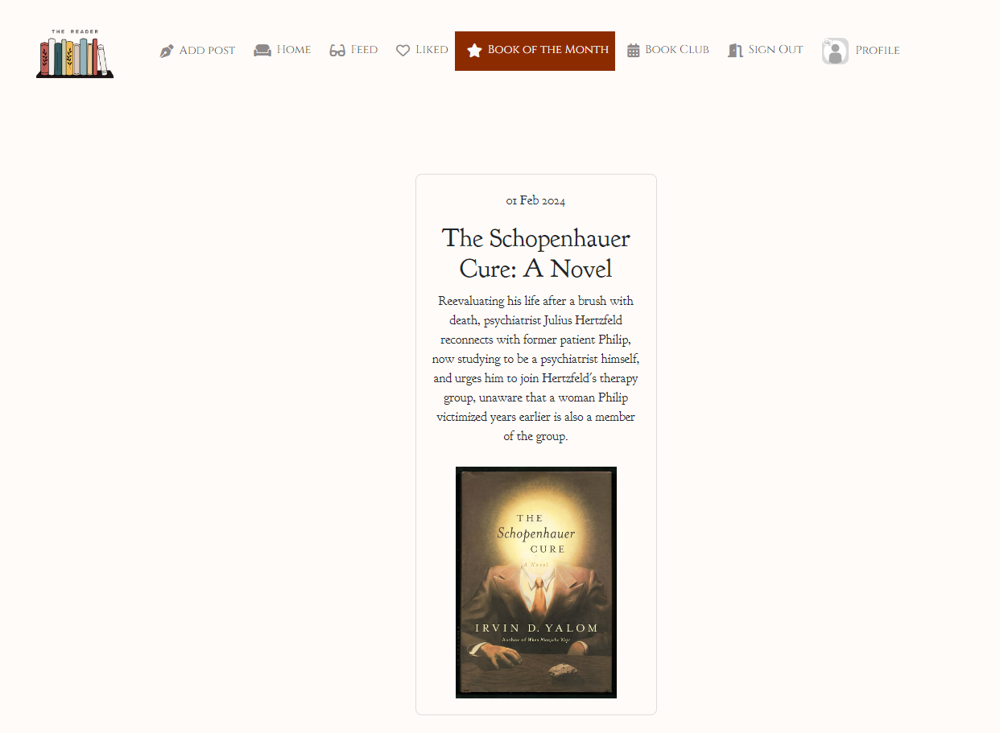
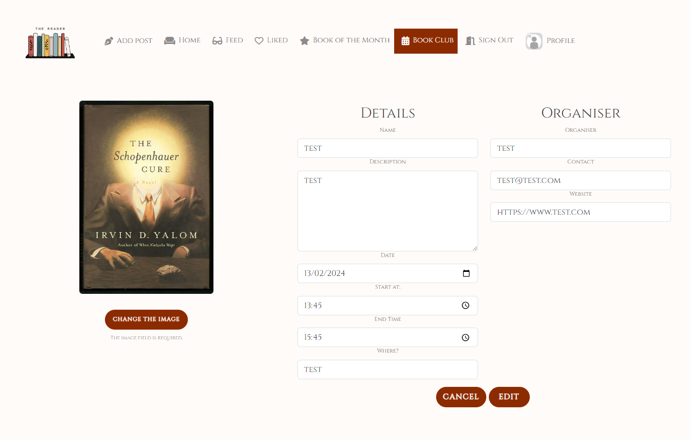

# Welcome to The Reader!


### **Backend**

Live site: https://the-reader-2a70cde2ef2e.herokuapp.com
Repo: https://github.com/vivienrauch/thereader-api

### **Frontend**
Live site: https://the-reader-react-1715725e4d83.herokuapp.com/
Repo: https://github.com/vivienrauch/thereader

# **Strategy Plane**

My objective with this community app was to bring those who have reading as a hobby closer together;
as well as having a functional app using agile planning, that entails the CRUD functionality, that can authenticate, make it possible for users to follow each other,
make up their own profile, be able to modify it, have some custom features like the "book of the month" or the "book club
events" and "responses".

## **Project & User Stories**

- [Kanban board](https://github.com/users/vivienrauch/projects/8/views/1)
- [User stories](https://github.com/vivienrauch/thereader-api/issues?q=is%3Aissue+is%3Aclosed)

# **Skeleton Plane**

## **Wireframes**

<details>
<summary>Wireframe Images</summary>

- Home, Feed, Liked pages


- Sign In, Sign Up pages


- Edit Profile page


- Book Club Event page


- Book Club Event page - Create/Edit


- Book Of The Month page


</details>

# **Structure Plane**

## **Features**

- Entity Relationship Diagram
    - The User model is the in-built Django User model.
    - Custom models: Response, BookClubEvent, BookOfTheMonth

```
+-----------------+       +-----------------+       +-------------------+
|    Response     |       |   BookClubEvent |       |   BookOfTheMonth  |
+-----------------+       +-----------------+       +-------------------+
| - id            |       | - id            |       | - id              |
| - owner         |<----->| - owner         |       | - title           |
| - bookclubevent |       | - event_name    |       | - content         |
| - created_at    |       | - event_descr.. |       | - image           |
+-----------------+       | - date          |       | - website         |
                          | - event_organ.. |       | - created_at      |
                          | - event_locati..|       | - updated_at      |
                          | - event_start   |       +-------------------+
                          | - event_end     |
                          | - contact       |
                          | - website       |
                          | - event_cover   |
                          +-----------------+
                                |
+---------------+               |
|     Like      |               |
+---------------+               |
| - id          |               |
| - owner       |<--------------+
| - post        |
| - created_at  |
+---------------+
       |
+-------------------+
|      Profile      |
+-------------------+
| - id              |
| - owner           |
| - created_at      |
| - updated_at      |
| - name            |
| - content         |
| - fav_book        |
| - image           |
+-------------------+
        |
+-------------------+
|      Comment      |
+-------------------+
| - id              |
| - owner           |
| - post            |
| - created_at      |
| - updated_at      |
| - content         |
+-------------------+
         |
+-------------------+
|     Follower      |
+-------------------+
| - id              |
| - owner           |
| - followed        |
| - created_at      |
+-------------------+
```

### **Existing Features**

- **Sign in and up**

This is the page logged out or unregistered users see. The rest of the options become available once they are signed in.


- **Home page & Navigation bar**

This is the page that are available to logged in users.


- **Profile, Edit profile**

On your profile both your posts and the events created by you get listed. The events count are also indicated under the username. When you want to edit your profile, you can modify your username, password, as well as your bio and profile picture.


- **Following and Popular profiles**

On the side you see other profiles listed, and you can click to follow them, so their posts and events will show up in your feed.


- **Book of the month**

This is a page moderated by the admin. It displays the so-called book of the month, that the members of the book club community should read and post about and create events related to. Clicking on the image redirects the user to a page where they can get the book.



- **Book Club Event**

The Book Club Events page lists events by the users. A user can create, edit and delete an event, as well as rsvp to an event.


This is what the user sees when they click on creating an event. They have to fill in the form properly, there are security checks in place to ensure, that the date of the event can't happen before the current date, as well as the end time can't happen before the start time.
The form expects proper email in the email field and proper website in the website field.
Additionally, only logged in users can create an event.


The user can also edit the event in case they are the owner of the event. When the user clicks on the title of the event, they will get redirected to the page of that singular event, where, if they are the owner, will see the 3 dots that indicate the possibility of edition and deletion.


When they click on edit, they will get the form prefilled with their previous information for their comfort in case they don't want to modify all details.



In case they want to delete their event, they will be prompted to confirm their decision in order to avoid accidental deletions.


When a user not logged in or own the event, they will get an alert when they try to RSVP to an event, that they need to log in/they are the owner of the event.


- **Commenting - create, edit, delete**

A user can comment under the posts of other users in case they are logged in. They can edit or delete the comment if they own it.


- **Liking-unliking**

Users can like and unlike other users posts.


- **Feed**

In the feed users can see the posts of users they follow.


- **Post - create, edit, delete**

When creating a post, the logged in user is prompted to provide a title, description as well as an image.
The user can edit or delete the post they own. They are prompted to confirm when deleting the post in order to avoid accidental deletions.


### **Future Features**

- I'd like to include a messaging functionality among the users
- I'd like to include a way to show the users which events they RSVP-d to without having to scroll through the event page
- As well as show the event owners how many RSVP their event got

# **Surface Plane**

## **Design**

Similarly to my first project, I used the color #8d2b00; a darker red a lot with the fonts Cinzel and Goudy Bookletter 1911 which create a bookish vibe. I wanted to create a cozy environment with the exterior of the app.

# **Testing**

Testing details can be found separately [here](https://github.com/vivienrauch/thereader/blob/main/TESTING.md).

# **Deployment**

- Open your Heroku dashboard.
- Click on "New" and choose "Create new app."
- Provide a meaningful name for your app and select the appropriate region.
- Go to the "Settings" tab.
- Click "Reveal Config Vars" to input key-value pairs from your .env file (excluding DEBUG and DEVELOPMENT).
- Add a buildpack by clicking "Add buildpack" and select "python" from the list. Save your changes.
- Navigate to the "Deploy" tab.
- Choose "GitHub - Connect to GitHub" as the deployment method.
- Click "Connect to GitHub" and search for your repository by name.
- Connect to the relevant repository and either enable automatic deploys or manually deploy by clicking "Deploy Branch."
- Access the deployed site by clicking "View."
- You can also find the live site in the environments section of your GitHub repository.

# **Technologies Used**

- React: to create the user interface
- Node: package manager to install dependencies
- Heroku: for hosting the application
- Git: version control
- GitHub: repository to store docs and code

# **Credits**

- Moments walkthrough
- forums like stackOverflow and Youtube
- slack
- fellow students
- inspirations: https://github.com/AlexaH88/gamer-guild
