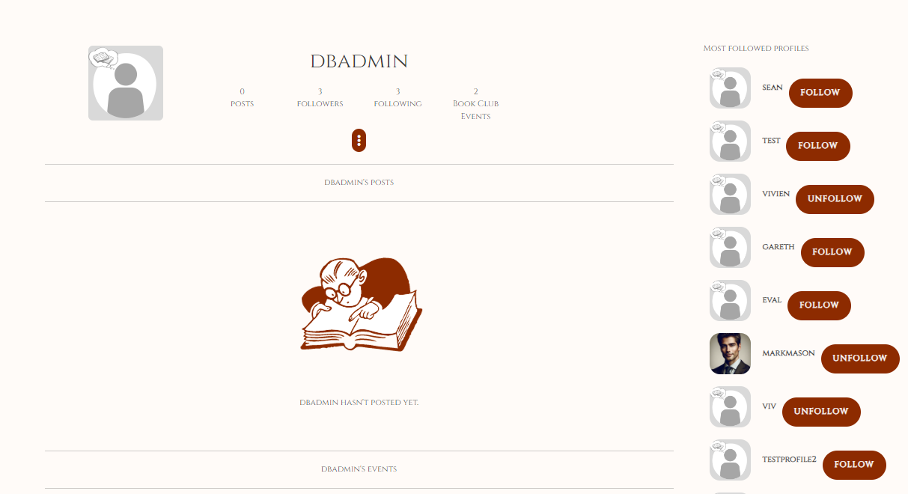

# Welcome to The Reader!

### **Backend**

Live site: https://the-reader-2a70cde2ef2e.herokuapp.com
Repo: https://github.com/vivienrauch/thereader-api

### **Frontend**
Live site: https://the-reader-react-1715725e4d83.herokuapp.com/
Repo: https://github.com/vivienrauch/thereader

# **Objective**

My objective with this community app was to bring those who have reading as a hobby closer together;
as well as having a functional app that can authenticate, make it possible for users to follow each other,
make up their own profile, be able to modify it, have some custom features like the book of the month or the book club
events.

## **User Stories**

- [Kanban board] (https://github.com/users/vivienrauch/projects/8/views/1)
- [User stories] (https://github.com/vivienrauch/thereader-api/issues)

## **Features**

- Entity Relationship Diagram
    - The following custom models were used in this project - the User model is the in-built Django User model.

+-----------------+       +-----------------+       +-------------------+
|    Response     |       |   BookClubEvent |       |   BookOfTheMonth  |
+-----------------+       +-----------------+       +-------------------+
| - id            |       | - id            |       | - id              |
| - owner         |<----->| - owner         |       | - title           |
| - bookclubevent |       | - event_name    |       | - content         |
| - created_at    |       | - event_descr.. |       | - image           |
+-----------------+       | - date          |       | - website         |
                          | - event_organ.. |       | - created_at      |
                          | - event_locati..|       | - updated_at      |
                          | - event_start   |       +-------------------+
                          | - event_end     |
                          | - contact       |
                          | - website       |
                          | - event_cover   |
                          +-----------------+
                                |
+---------------+               |
|     Like      |               |
+---------------+               |
| - id          |               |
| - owner       |<--------------+
| - post        |
| - created_at  |
+---------------+
       |
+-------------------+
|      Profile      |
+-------------------+
| - id              |
| - owner           |
| - created_at      |
| - updated_at      |
| - name            |
| - content         |
| - fav_book        |
| - image           |
+-------------------+
        |
+-------------------+
|      Comment      |
+-------------------+
| - id              |
| - owner           |
| - post            |
| - created_at      |
| - updated_at      |
| - content         |
+-------------------+
         |
+-------------------+
|     Follower      |
+-------------------+
| - id              |
| - owner           |
| - followed        |
| - created_at      |
+-------------------+

### **Design**

Similarly to my first project, I used the color #8d2b00; a darker red a lot with the fonts Cinzel and Goudy Bookletter 1911 which create a bookish vibe. I wanted to create a cozy environment with the exterior of the app.
It still needs some improvement, but the main idea is visible on the current features as well.

### **Existing Features**

- Sign in and up

- Home page

- Profile, edit

- Following and Popular profiles

- Book of the month

- Book Club Event, create (edit, delete - future feature)

- Commenting - create, edit, delete

- Liking-unliking

- Feed

- Post - create, edit, delete

### **Future Features**

- There were multiple features that unfortunately I couldn't get to render in the frontend app, mostly due to lack of time and last-minute errors, so those are marked as In Progress in the Kanban board
    - To be able to RSVP an event
    - To remove that response from an event
    - To have the event render without having to refresh the page and with the full details

# **Testing**

Testing details can be found separately in the api repository in the TESTING.md file: https://github.com/vivienrauch/thereader-api/blob/main/TESTING.md.

# **Deployment**

- Open your Heroku dashboard.
- Click on "New" and choose "Create new app."
- Provide a meaningful name for your app and select the appropriate region.
- Go to the "Settings" tab.
- Click "Reveal Config Vars" to input key-value pairs from your .env file (excluding DEBUG and DEVELOPMENT).
- Add a buildpack by clicking "Add buildpack" and select "python" from the list. Save your changes.
- Navigate to the "Deploy" tab.
- Choose "GitHub - Connect to GitHub" as the deployment method.
- Click "Connect to GitHub" and search for your repository by name.
- Connect to the relevant repository and either enable automatic deploys or manually deploy by clicking "Deploy Branch."
- Access the deployed site by clicking "View."
- You can also find the live site in the environments section of your GitHub repository.

# **Technologies Used**

- Programming Languages:

    - Python

- Frameworks, Libraries, and Tools Used:

    - Django: Utilized for the development of the web application.
    - Django Rest Framework: Employed to streamline communication between the backend and frontend components.
    - PostgreSQL: Chosen as the object-relational database system.
    - ElephantSQL: Used as the hosting service for the database.
    - Git: Implemented for version control, with Gitpod terminal facilitating commits to Git and pushes to GitHub.
    - GitHub: Serves as the repository for storing the project's code after it's pushed from Git.
    - Heroku: Selected for deploying the application.

# **Credits**

- Moments walkthrough
- forums like stackOverflow and Youtube
- slack
- fellow students
- inspirations: https://github.com/AlexaH88/gamer-guild
