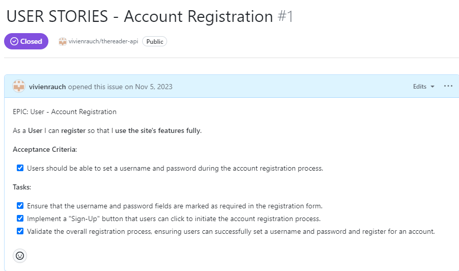
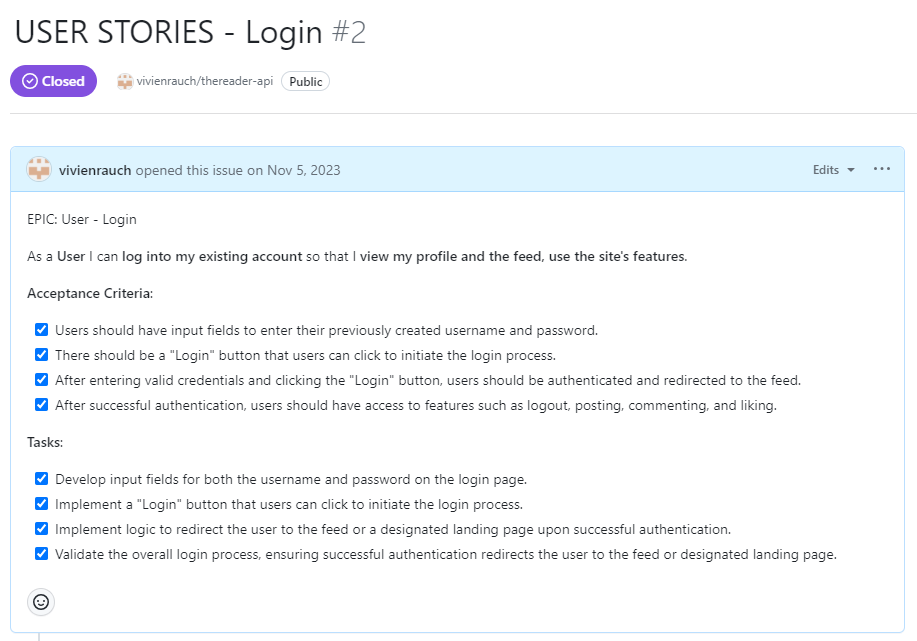
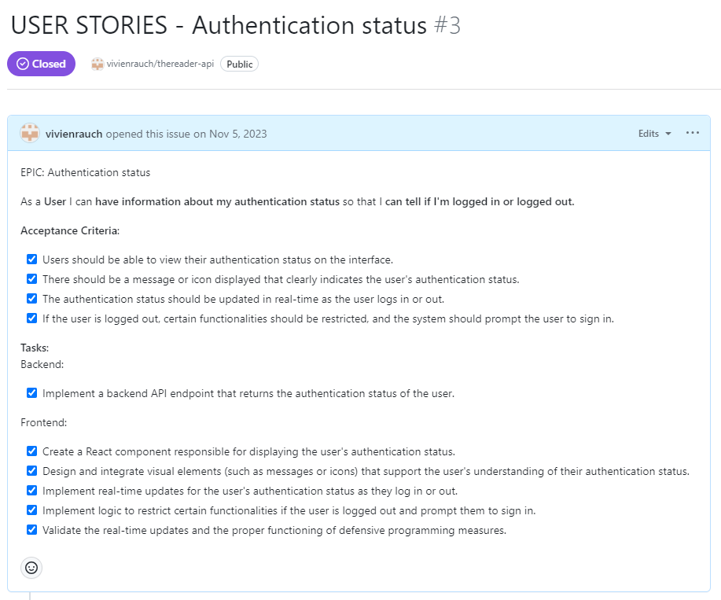
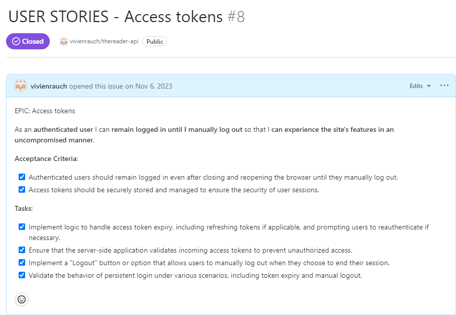
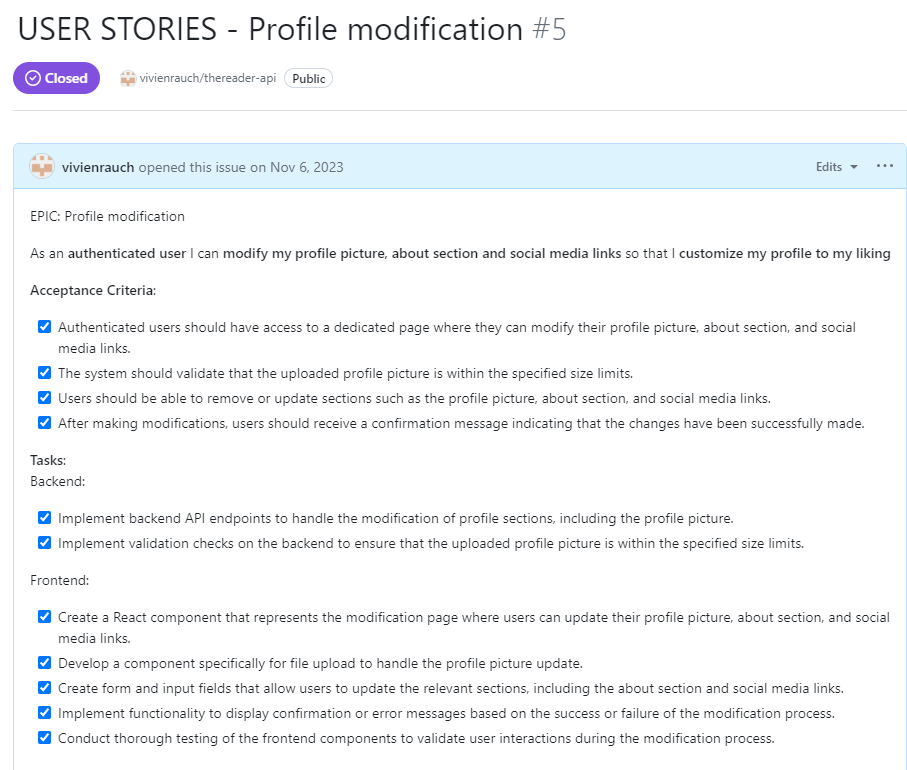
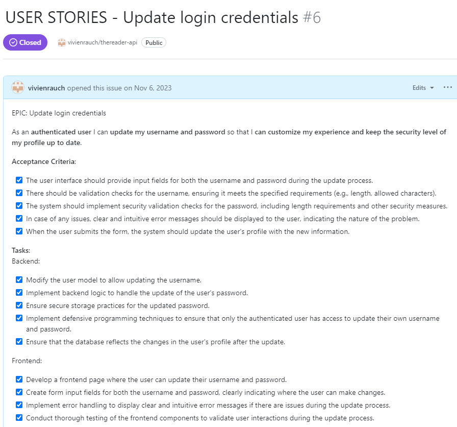
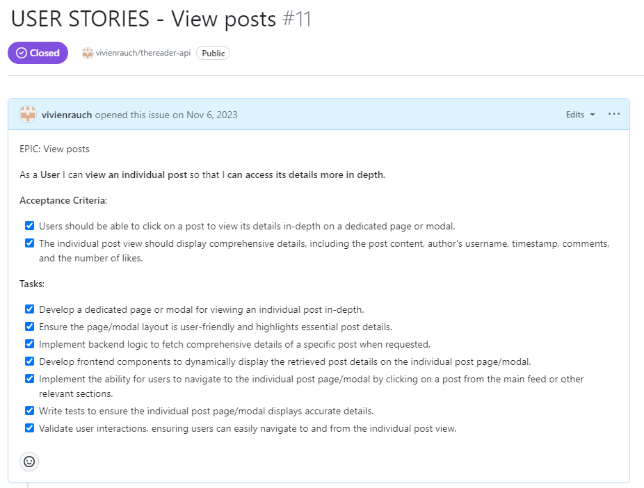

# **Manual Testing - User Stories**

## **Authentication, tokens, navigation**

Registration

- **User Story:**

- Required Fields:

The registration form correctly marks the username and password fields as required, preventing submission without these essential details.

- Sign-Up Button:

The presence and functionality of the "Sign-Up" button are confirmed, allowing users to initiate the account registration process effortlessly.

- Username Setting:

Users can input and submit a desired username during the registration process without encountering issues.

- Password Setting:

Users can input and submit a password, and the registration system securely handles the process.

- Error Messages:

Clear and meaningful validation messages are displayed if a user attempts to register without providing the required username or password.

- Username Uniqueness:

The registration system enforces username uniqueness, preventing users from registering with an already existing username.
Intentionally triggered errors prompt meaningful error messages, ensuring users are informed when issues like incorrect password length occur during the registration process.

- User Interaction:

Upon successful registration users are redirected to the "Sign In" page.
Users when not registered or not signed in can't access all features of the site.

Authentication Status, Access Tokens

- **User Story**:

- Username and Password Fields:

Input fields for both the username and password are present on the login page, allowing users to enter their credentials.

- Login Button:

The "Login" button is implemented and functional, enabling users to initiate the login process effortlessly.
Authentication and Redirection:

Users, after entering valid credentials and clicking the "Login" button, are successfully authenticated and redirected to the feed or a designated landing page.

- Access to Features:

Upon successful authentication, users have access to the sites features, including logout, posting, commenting, and liking.

- Logout Functionality:

The logout feature works as expected, logging the user out and redirecting them to the appropriate landing page.

- Error messages:

Clear and informative error messages are displayed if a user attempts to log in with incorrect credentials.

- **User Story**:

- Once the user is logged in, they see the features they haven't before and the signout button on the navbar also clearly indicates that they are signed in.
- When they are signed out, they are prompted to sign in again and lose access to the features.

- **User Story**

- Tested opening the page in a new tab, the user remains logged in until they press the logout button.

## **Profiles**

Profile edit

- **User Story:**

- The User can change their profile picture and optionally update their bio.
- Upon successful update, the User gets redirected to their profile page and their updates will become visible, indicating that they've succeeded.

Profile login credentials update

- **User Story:**

- Only logged in users have accessibility to the function.
- They can edit their username and their password.
- There are security checks in place to ensure correct length and character usage.

## **Posts**

Viewing Posts

- **User Story:**

- Access Individual Post:

Clicking on a post opens a dedicated page/modal to display the individual post, and this functionality works seamlessly.

- User-Friendliness:

The layout of the individual post page/modal is intuitive and user-friendly.
Essential post details are prominently highlighted, contributing to a positive user experience.

- Comprehensive Details:

The individual post view includes accurate and comprehensive details such as post content, author's username, timestamp, comments, and likes.

- Backend Logic:

Backend logic successfully fetches comprehensive details for a specific post without any issues.

- Frontend Components:

Frontend components dynamically display the retrieved post details as intended, providing a smooth user interface.

- User Interactions:

Liking or commenting on a post from the individual view functions properly, with immediate and accurate reflections.
Cross-Browser Testing:

The individual post view performs consistently across different browsers, maintaining uniform behavior and appearance.

## **Comments**

## **Book Of The Month**

## **Book Club Events**

# **Lighthouse**

# **Responsiveness**

# **Validator Testing**

# **Bugs & Fixes**

