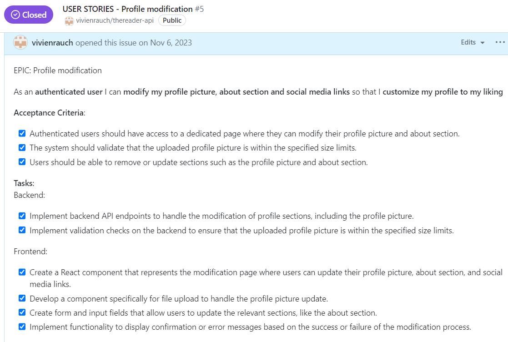

# **Manual Testing - User Stories**

## **Authentication, tokens, navigation**

Registration

- **User Story:**

- **Required Fields:** The registration form correctly marks the username and password fields as required, preventing submission without these essential details.

- **Sign-Up Button:** The presence and functionality of the "Sign-Up" button are confirmed, allowing users to initiate the account registration process effortlessly.

- **Username Setting:** Users can input and submit a desired username during the registration process without encountering issues.

- **Password Setting:** Users can input and submit a password, and the registration system securely handles the process.

- **Error Messages:** Clear and meaningful validation messages are displayed if a user attempts to register without providing the required username or password.

- **Username Uniqueness:** The registration system enforces username uniqueness, preventing users from registering with an already existing username.
Intentionally triggered errors prompt meaningful error messages, ensuring users are informed when issues like incorrect password length occur during the registration process.

- **User Interaction:** Upon successful registration users are redirected to the "Sign In" page.
Users when not registered or not signed in can't access all features of the site.

Authentication Status, Access Tokens

- **User Story**:

- **Username and Password Fields:** Input fields for both the username and password are present on the login page, allowing users to enter their credentials.

- **Login Button:** The "Login" button is implemented and functional, enabling users to initiate the login process effortlessly.

- **Authentication and Redirection:** Users, after entering valid credentials and clicking the "Login" button, are successfully authenticated and redirected to the feed or a designated landing page.

- **Access to Features:** Upon successful authentication, users have access to the sites features, including logout, posting, commenting, and liking.

- **Logout Functionality:** The logout feature works as expected, logging the user out and redirecting them to the appropriate landing page.

- **Error messages:** Clear and informative error messages are displayed if a user attempts to log in with incorrect credentials.

- **User Story**:

- **Authentication Status Display:** Users can view their authentication status prominently displayed on the interface.

- **Visual Elements:** Visual elements, such as messages or icons, effectively communicate the user's authentication status.

- **Real-time Updates:** The authentication status is updated in real-time as the user logs in or out.

- **Restricted Functionalities:** When the user is logged out, certain functionalities are appropriately restricted, ensuring a secure experience.

- **Prompt to Sign In:** The system prompts the user to sign in when attempting to access functionalities that require authentication.

- **Backend API Endpoint:** The backend API endpoint accurately returns the authentication status of the user.

- **React Component:** The React component responsible for displaying the authentication status functions as intended, providing a clear representation.

- **Visual Design:** The visual design of messages or icons aligns with the overall UI/UX and enhances user understanding of their authentication status.

- **Real-time Validation:** Real-time updates are validated, confirming that the authentication status changes promptly and reflects the user's actions.

- **Restricted Functionality:** The logic to restrict certain functionalities for logged-out users is well-implemented.

- **Prompting Mechanism:** The mechanism prompting users to sign in is effective and user-friendly.

- **User Story:**

- **Persistent Login:** Authenticated users remain logged in even after closing and reopening the browser until they manually log out.

- **Token Expiry Handling:** Logic to handle access token expiry is successfully implemented, including token refresh.

- **Reauthentication Prompt:** Users are appropriately prompted to reauthenticate if necessary, ensuring the security of the system.

- **Server-side Token Validation:** The server-side application accurately validates incoming access tokens, preventing unauthorized access.

- **Sign OUt Button:** A "Sign Out" button or option is available, allowing users to manually log out when they choose to end their session.

- **Manual Logout:** The behavior of persistent login is validated when users manually log out, confirming their session termination.

## **Profiles**

Profile edit

- **User Story:**

- **Access to Modification Page:** Authenticated users have access to a dedicated page for modifying their profile picture and bio.

- **Profile Picture Modification:** Users can successfully upload a new profile picture, and the system validates that the uploaded image adheres to the specified size limits.

- **Bio Modification:** Users can update their bio, and the changes are accurately saved and displayed on their profile.

- **File Upload Component:** The file upload component for profile pictures functions as intended, providing a user-friendly way to select and upload images.

- **Form and Input Fields:** The modification page includes clear and intuitive form fields for updating the profile picture and bio.

Profile login credentials update

- **User Story:**

- **Access to Update Page:** Authenticated users can access a dedicated page for updating their username and password.

- **Username Update:** Users can successfully update their username, and the system enforces validation checks to ensure it meets specified requirements (e.g., length, allowed characters).

- **Password Update:** The system implements security validation checks for updating the password, including length requirements and other security measures.

- **Error Handling:** Clear and intuitive error messages are displayed if users encounter issues while updating their username or password.

- **Form Input Fields:** The update page includes form input fields for both the username and password, clearly indicating where users can make changes.

- **Defensive Programming:** Defensive programming techniques are in place to guarantee that only the authenticated user has access to update their own username and password.

- **Database Reflection:** The database accurately reflects the changes in the user's profile after the update, ensuring data consistency.

- **Submission Process:** When users submit the update form, the system correctly processes the information, updating the user's profile with the new username and password.

- **Data Persistence:** Updated login credentials persist accurately, and users can log in with the new information upon subsequent visits.

Follow & Unfollow Users

- **User Story:**

- **Follow Action:** Clicking the "Follow" button next to another user's profile registers the action on the backend.

- **Unfollow Action:** Clicking the "Unfollow" button next to a user's profile correctly registers the action on the backend.

- **Authentication Checks:** Proper authentication checks are in place to ensure only authenticated users can perform follow and unfollow actions.

- **Backend Logic:** The backend logic accurately updates the database when a user follows or unfollows another user, ensuring data consistency and integrity.

- **Privacy Settings:** Implemented privacy settings control who can follow a user, providing the desired level of user control.

- **Followers List Update:** On the user's profile page, the follower's profile is correctly added or removed from the list of followers based on follow or unfollow actions.

- **Follower Count:** The follower count of the user being followed increments or decreases by one based on the follow or unfollow action.

- **Follow/Unfollow Button Design:** The "Follow/Unfollow" button is well-designed and seamlessly integrated into the user interface.

- **Button States:** The button has different states such as 'Follow,' 'Following,' and 'Unfollow,' with visual updates reflecting the current state.

- **Dynamic UI Updates:** The UI dynamically updates to reflect changes in the follower count and the appearance of the "Follow/Unfollow" button.

- **Intuitive UI:** The user interface is intuitive, making it clear to users the current follow state and how to initiate follow or unfollow actions. Testing confirms smooth transitions between different button states, providing a seamless and visually appealing user experience.

- **Response Handling:** Frontend logic handles responses from the backend after a user follows or unfollows another user, ensuring accurate and timely updates.

## **Posts**

Viewing Posts & Individual Post

- **User Story:**

- **Access Individual Post:** Clicking on a post opens a dedicated page to display the individual post, and this functionality works seamlessly.

- **User-Friendliness:** The layout of the individual post page/modal is intuitive and user-friendly.
Essential post details are prominently highlighted, contributing to a positive user experience.

- **Comprehensive Details:** The individual post view includes accurate and comprehensive details such as post content, author's username, timestamp, comments, and likes.

- **Backend Logic:** Backend logic successfully fetches comprehensive details for a specific post without any issues.

- **Frontend Components:** Frontend components dynamically display the retrieved post details as intended, providing a smooth user interface.

- **User Interactions:** Liking or commenting on a post from the individual view functions properly, with immediate and accurate reflections.

Creating Posts

- **User Story:**

- **"Create Post" Button:** A "Create Post" button is present within the user interface for authenticated users.

- **Access Control:** Only logged-in users can access the "Create Post" button; attempts by non-authenticated users are appropriately restricted.

- **Form Accessibility:** Clicking on the "Create Post" button opens a form allowing users to input details such as title, content, and any other relevant information for creating a new post.

- **Form Submission:** Users can submit the post through the form, and the system registers the new post in the database.

- **Backend Logic:** Backend logic to handle the creation of posts is implemented and functions as expected.

- **Backend Unit Testing:** Unit tests for the backend logic accurately cover various scenarios related to post creation.

Editing Posts

- **User Story:**

- **"Edit" Button:** Authenticated users who are creators of a post have an "Edit" button or option next to their posts.

- **Access Control:** The "Edit" button is visible only to the authenticated user who owns the post; unauthorized access is appropriately restricted.

- **Editing Interface:** Clicking the "Edit" button opens an interface allowing users to modify the title and content of their post.

- **Pre-filled Information:** The interface pre-fills with the current title and content for easy modification.

- **Form Accessibility:** The form component allows users to edit the title and content of their posts.

- **Backend Logic:** Backend logic to handle the modification of posts is implemented and functions as expected.

- **Update Frontend:** The frontend updates seamlessly when a post is successfully modified.

- **Backend Unit Testing:** Tests for the backend logic accurately cover various scenarios related to post modification.

Deleting Posts

- **User Story:**

- **"Delete" Button:** Authenticated users who own a post have a "Delete" button or option next to their posts. Clicking the "Delete" button triggers the post deletion process.

- **Access Control:** The "Delete" button is visible only to the authenticated user who owns the post; unauthorized access is appropriately restricted.

- **Confirmation Prompt:** When attempting to delete a post, there is a confirmation prompt to prevent accidental deletions.

- **Backend Logic:** Backend logic to handle the deletion of posts is implemented and functions as expected.

- **Update Frontend:** The frontend updates seamlessly when a post is successfully deleted.

- **Visual Notice:** Users visually notice that the post has been deleted, with appropriate UI changes.

- **Unit Tests**: Tests for the backend logic accurately cover various scenarios related to post deletion.

Liking & Unliking Posts

- **User Story:**

## **Comments**

Viewing Comments

- **User Story:**

- **Comment Section Visibility:** On each post or content page, a clearly visible section dedicated to displaying comments is present.

- **Comment Presentation:** Comments are presented in a clear and organized manner, showing the commenter's username, timestamp, and the content of the comment.

- **Design Integration:** The design for the comment section is visually appealing and seamlessly integrates with the overall user interface.

- **Comments Component:** The component responsible for displaying the list of comments on a post is functioning as expected.

- **Visual Styles:** Styles applied to enhance the visual presentation of the comments section are effective, making it easy to read and navigate.

- **Timestamp Format:** Timestamps are displayed in a user-friendly format, such as "2 hours ago" or "yesterday."

- **Responsive Design:** The comment section responds well to different screen sizes, ensuring a consistent and enjoyable user experience across devices.

Creating comments

- **User Story:**

- **Comment Display:** Authenticated users can clearly see comments under posts, including the content of the comments and the timestamp of when they were posted.

- **Create Comment:** Authenticated users can successfully create comments on posts using the designated frontend interface.

- **Timestamp Display:** Comments display timestamps indicating when they were posted, enhancing the context for users.

Editing comments

- **User Story:**

- **Edit Comment Button:** Authenticated users who own a comment can see an "Edit" button next to their comments, ensuring visibility only for the comment owner.

- **Form Accessibility:** The form component for editing comments is accessible to the authenticated user, providing a seamless interface for content modification.

- **Pre-filled Information:** The interface pre-fills with the current content of the comment, simplifying the modification process for the user.

- **Backend Logic:** Backend logic to handle the modification of comments is successfully implemented and functions as expected.

Deleting comments

- **User Story:**

- **Delete Comment Button:** Authenticated users who own a comment can see a "Delete" button next to their comments, ensuring visibility only for the comment owner.

- **Backend Logic:** Backend logic to handle the deletion of comments is successfully implemented and functions as expected.

- **Update Frontend:** The frontend updates dynamically when a comment is successfully deleted, ensuring a seamless and real-time user experience. Asynchronous techniques are employed to remove the comment from the feed without requiring a full page reload, enhancing user interaction.

- **Unit Testing:** Thorough tests for the backend logic accurately cover various scenarios related to comment deletion, ensuring robust functionality.

## **Book Of The Month**

Rendering Book Of The Month

- **User Story:**

- **Admin Privileges:** Admin privileges control access to the Book of the Month functionality as intended. Non-admin users are appropriately restricted.

- **Database Schema:** The database schema effectively stores comprehensive information related to the Book of the Month, accommodating all necessary details.

- **Backend API Endpoints:** Backend API endpoints for retrieving and updating Book of the Month information have been successfully tested.

- **Book of the Month Section:** The dedicated section for the Book of the Month is visible on the platform's main page and is accessible only to users with admin privileges.

- **Display Component:** The frontend component displays the Book of the Month information in a user-friendly format, presenting all relevant details.

## **Book Club Events**

Viewing Book Club Events & Individual Event

- **User Story:**

- **Ordering:** Book club events are displayed in descending chronological order, with the freshest event appearing first.

- **Clear Display:** The component displays book club events in a clear and organized manner, presenting relevant information such as event title and date prominently.

- **Visual Presentation:** Visual styles enhance the presentation of the event listing as well as individual event presentation upon clicking, making it intuitive for users.

- **Date Visibility:** Date information for each event is clearly visible and distinguishable, allowing users to identify and understand the chronological order.

- **Infinite Scrolling:** Infinite scrolling function allowing users to navigate through multiple pages or load more events seamlessly.

Creating a Book Club Event

- **User Story:**

- **Access for Authenticated Users:** Authenticated users have access to the "Create Event" feature.

- **Visibility of "Create Event" Button:** The "Create Event" button is appropriately integrated within the user interface for authenticated users.

- **Form Fields:** The form component allows users to input details such as title, description, date, and location for a new book club event.

- **User-Friendly Design:** The form is designed to be user-friendly, providing a seamless experience for users when creating a new event.

- **Validation for Required Fields:** The form includes necessary validation for required fields, ensuring that users cannot submit incomplete data.

- **Data Format Validation:** Validation checks for data formats (date, etc.) are implemented to maintain data integrity.

Modifying a Book Club Event

- **User Story:**

Deleting a Book Club Event

- **User Story:**

RSVP-ing to a Book Club Event

- **User Story:**

# **Lighthouse**

# **Responsiveness**

# **Validator Testing**

# **Bugs & Fixes**

