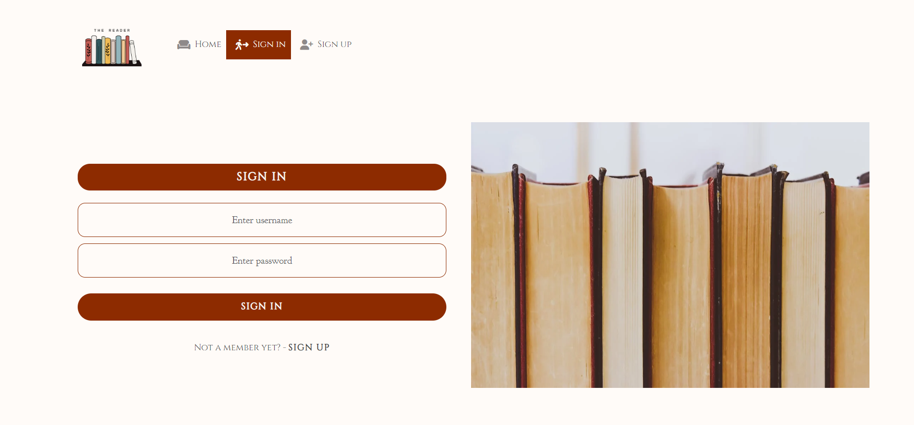

# **Manual Testing - User Stories**

## **Authentication, tokens**

Registration

- **User Story:**

- The User is clearly prompted on the login page to enter their credentials. There are security settings set to make sure the username and the password have proper length and characters.
- When the user is not logged in, they don't have access to the features of the profile.

Authentication Status, Access Tokens

- **User Story**:

- Once the user is logged in, they see the features they haven't before and the signout button on the navbar also clearly indicates that they are signed in.
- When they are signed out, they are prompted to sign in again and lose access to the features.

- **User Story**

- Tested opening the page in a new tab, the user remains logged in until they press the logout button.

## **Profiles**

## **Posts**

## **Comments**

## **Book Of The Month**

## **Book Club Events**

# **Lighthouse**

# **Responsiveness**

# **Validator Testing**

# **Eslint**

# **Bugs & Fixes**

